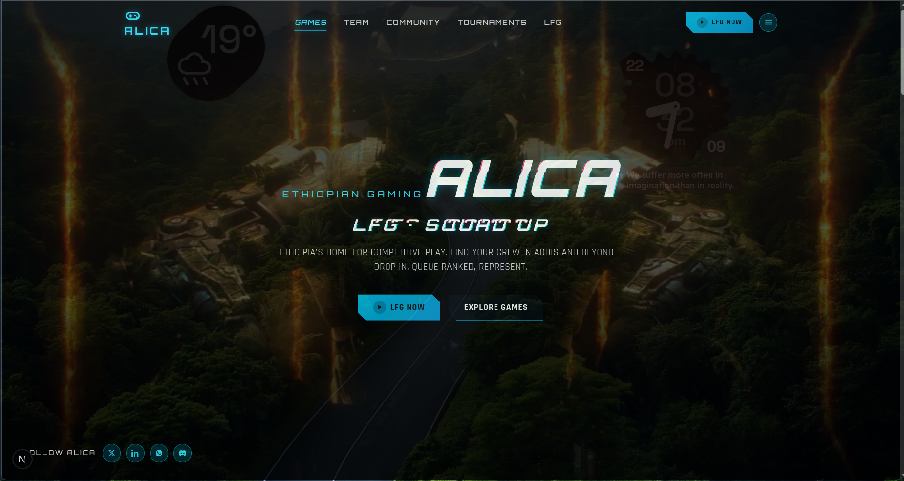
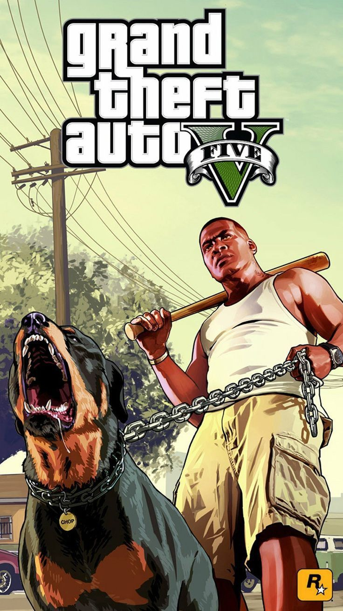
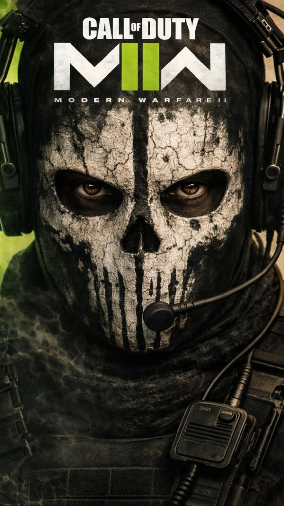
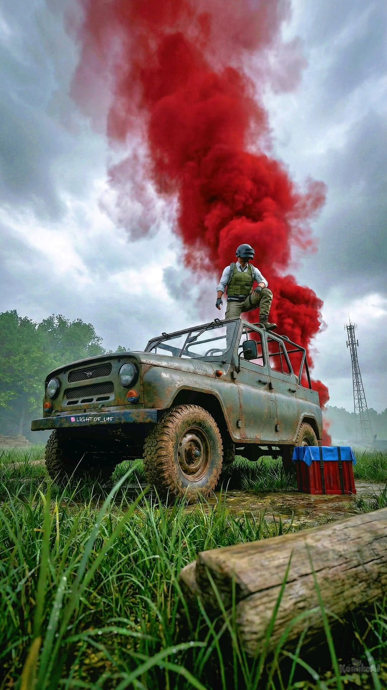
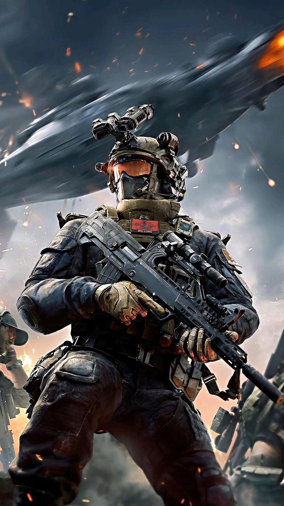
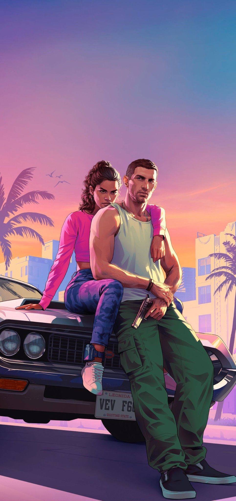
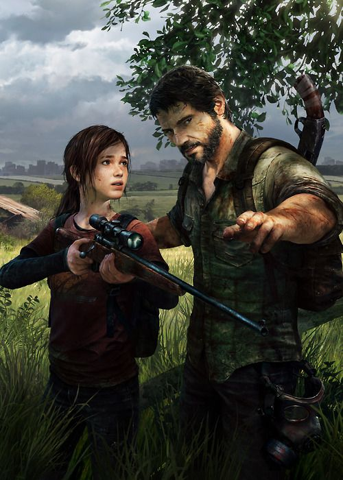
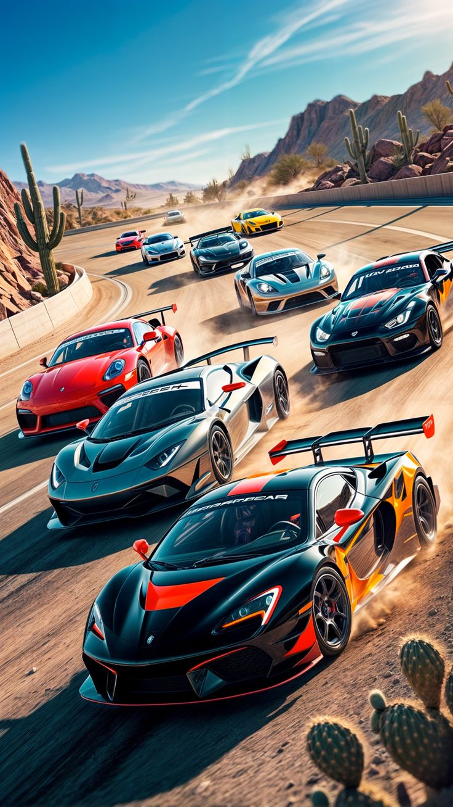
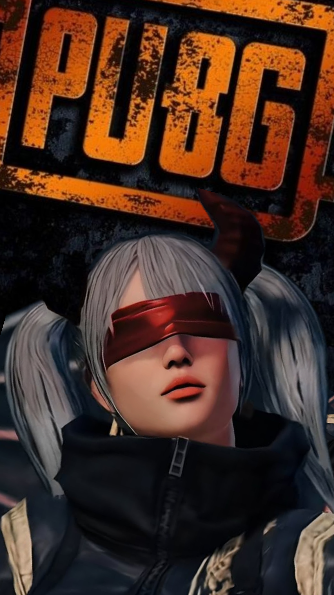

<p align="center">
  
</p>

<h1 align="center">⚡ ALICA</h1>
<p align="center">
  <b>Ethiopian Gaming · LFG · Squad Up</b>
</p>

<p align="center">
  Cyberpunk landing-page <b>template</b> for gaming communities, esports crews, and LFG hubs — from Addis to the world.
</p>

<p align="center">
  <a href="https://alica-lfg.vercel.app"></a>
</p>

<p align="center">
  
  
  
  
  
</p>

<p align="center">
  <a href="#-featured-games">Games</a> ·
  <a href="#-why-alica">Why ALICA</a> ·
  <a href="#-features">Features</a> ·
  <a href="#-quick-start">Quick start</a> ·
  <a href="#-seo--social">SEO</a> ·
  <a href="#-customize">Customize</a> ·
  <a href="#-license">License</a>
</p>

---

## 🎮 Featured games

Ship the template with real poster art from `public/assets/games/` — drop-in visuals for the gameplay carousel.

<p align="center">
  
  &nbsp;
  
  &nbsp;
  
  &nbsp;
  
</p>

<p align="center">
  
  &nbsp;
  
  &nbsp;
  
  &nbsp;
  
</p>

| Title | File | Built-in detail blurb |
| :---: | :---: | --- |
| **GTA V** | `gta.jpg` | Heists, freemode, Ethiopian crew nights |
| **COD MWII** | `cod.png` | Ranked stacks, Search & Destroy, mic-on LFG |
| **PUBG** | `pubg.png` / `pubg2.jpg` | Squad IGL, circle clutches, Conqueror grind |
| **DELTA FORCE** | `deltaforce.jpg` | Tactical ops & extraction sessions |
| **LAST OF US** | `lastofus.jpg` | Story co-op, cinematic nights |
| **CAR RUSH** | `car.jpg` | Party races & lobby fun |
| **GTA ONLINE** | `gta2.jpg` | Business grind & social PVP |

> Swap these files or add more under `public/assets/games/` — the carousel picks them up from `GAMES` in `src/app/page.tsx`.

---

## 🚀 Live preview

<p align="center">
  <a href="https://alica-lfg.vercel.app">
    
  </a>
</p>

<p align="center">
  <b>👉 <a href="https://alica-lfg.vercel.app">https://alica-lfg.vercel.app</a></b>
</p>

---

## 🔥 Why ALICA?

**ALICA** is a ready-to-fork **Next.js gaming landing page** built for Ethiopian LFG culture — find a squad, queue ranked, run tournaments, and look like a real esports brand on day one.

| | |
| --- | --- |
| 🎥 | Full-site **video background** (Cloudinary / CDN) |
| 🕹️ | **Game cards** with auto-swap + mobile swipe |
| 📋 | **Game detail panel** — genre, modes, vibe, generated copy |
| 👥 | **LFG feed** + **tournament cards** (10 demos each) |
| ✨ | Cyan HUD / glitch accents — tuned so it stays smooth |
| 🔍 | SEO-ready: OG, Twitter, JSON-LD, robots, sitemap |
| 📜 | **MIT** by **Miftah Fentaw** — fork it, brand it, ship it |

---

## ✨ Features

```text
  ┌─────────────┐   ┌─────────────┐   ┌─────────────┐
  │  HERO + LFG │ → │  GAME PLAY  │ → │  TOURNAMENTS│
  │  brand first│   │  + details  │   │  + LFG posts│
  └─────────────┘   └─────────────┘   └─────────────┘
```

- **Brand-first hero** — ALICA as the main signal, not a tiny nav logo  
- **Responsive** — phone scroll carousels · tablet/desktop auto-swap + arrows  
- **Gameplay details** — tap a title, read why Ethiopian crews queue it  
- **Dummy social proof** — 10 LFG posts · 10 tournament events  
- **Local game art** — posters above, ready for screenshots & marketing  
- **Fonts** — Orbitron + Rajdhani  
- **Clip-path** cyber buttons & cards  
- `prefers-reduced-motion` respected for accessibility  

---

## 🛠️ Stack

| Layer | Tech |
| :---: | --- |
| Framework | **Next.js 16** (App Router) |
| UI | **React 19** + **Tailwind CSS 4** |
| Language | **TypeScript** |
| Images | `next/image` + `public/assets/games/` |
| Video | Cloudinary hero (configurable) |
| SEO | Metadata · OG · Twitter · JSON-LD · robots · sitemap |

---

## ⚡ Quick start

```bash
git clone https://github.com/miftah/Alica-Gaming-LFG-Template.git
cd Alica-Gaming-LFG-Template
npm install
npm run dev
```

Open **http://localhost:3000** — you’re live.

```bash
npm run build   # production
npm run start   # serve build
npm run lint    # eslint
```

### Environment

```bash
# .env.local
NEXT_PUBLIC_SITE_URL=https://alica-lfg.vercel.app
```

---

## 📁 Structure

```text
public/
├── previeww.png              ← social / README banner
├── assets/games/             ← 🎮 poster art (GTA, COD, PUBG…)
│   ├── gta.jpg
│   ├── cod.png
│   ├── pubg.png
│   └── …
└── site.webmanifest
src/
├── app/
│   ├── layout.tsx            ← SEO + fonts + JSON-LD
│   ├── page.tsx              ← full landing experience
│   ├── robots.ts
│   └── sitemap.ts
└── components/
    └── SwapCarousel.tsx      ← swipe + auto-swap (cards only)
LICENSE                       ← MIT © Miftah Fentaw
```

---

## 🔍 SEO & social

| Capability | Status |
| --- | :---: |
| Title + description + keywords | ✅ |
| Open Graph (`previeww.png`) | ✅ |
| Twitter large image card | ✅ |
| Favicon / Apple / 512 icon | ✅ |
| JSON-LD (WebSite · Person · App · Org) | ✅ |
| `/robots.txt` + `/sitemap.xml` | ✅ |
| Web manifest | ✅ |
| Canonical + `metadataBase` | ✅ → `alica-lfg.vercel.app` |

Author / creator credited as **Miftah Fentaw** in metadata & package.json.

**GitHub tip:** Settings → Social preview → upload `public/previeww.png`.

---

## 🎨 Customize

| Want to change… | Edit |
| --- | --- |
| Game list & detail blurbs | `GAMES` in `src/app/page.tsx` |
| Poster images | Drop files in `public/assets/games/` |
| LFG / tournament demos | `LFG_POSTS` / `TOURNAMENTS` |
| SEO title & description | `src/app/layout.tsx` |
| Hero video URL | `HERO_VIDEO` in `page.tsx` |
| Colors / glitch / HUD | `src/app/globals.css` |

---

## ☁️ Deploy

1. Import the repo on [Vercel](https://vercel.com)  
2. Set `NEXT_PUBLIC_SITE_URL=https://alica-lfg.vercel.app`  
3. Ship → **[alica-lfg.vercel.app](https://alica-lfg.vercel.app)**  

---

## 👤 Author

<p align="center">
  <b>Miftah Fentaw</b><br />
  ALICA — Ethiopian Gaming LFG Template<br />
  <a href="https://github.com/miftah">GitHub</a>
</p>

Stars & forks are appreciated — attribution is nice, **not required** under MIT.

---

## 📜 License

```text
MIT License
Copyright (c) 2026 Miftah Fentaw
```

Free to use, modify, and sell. Keep the license notice. Full text: [`LICENSE`](LICENSE).

---

<p align="center">
  
  
  
  
  
  
</p>

<p align="center">
  <b>LFG from Addis to the world.</b><br />
  Made with ⚡ for Ethiopian gamers · by <b>Miftah Fentaw</b>
</p>
